# 🍌 Overripe
<p align="center">
  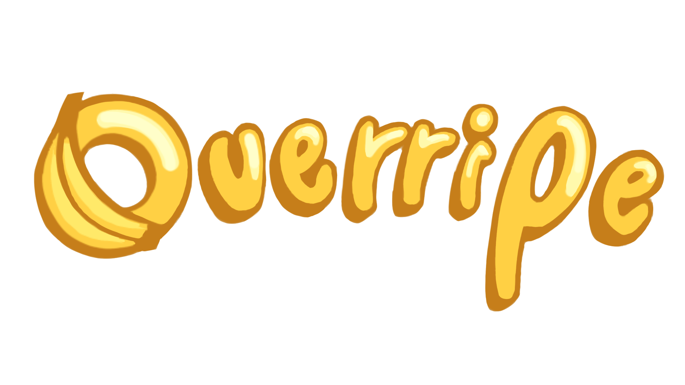
</p>

<p align="center">
  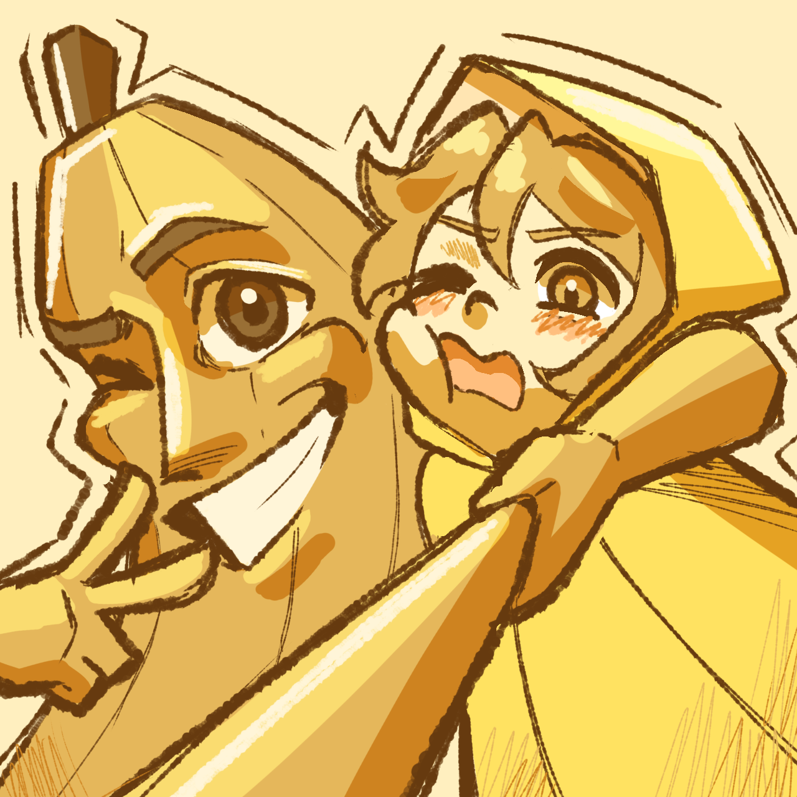
</p>
<p align="center">
  <strong>A 2D action platformer where your own body is the clock.</strong>
</p>

<p align="center">
  <a href="https://maryamahmed0.itch.io/overripe">
    
  </a>
</p>

---

## 🎮 Game Overview

**Overripe** is a 2D action platformer created for the **IEEE Victories 5.0 Game Development Competition**, organized by the **IEEE Mansoura Student Branch**, with the theme **Time**.

The artifact that keeps the Banana Kingdom from rotting has been stolen.

You set out to recover it — knowing that every second away from it brings you closer to rotting yourself.

|                     |                          |
| ------------------- | ------------------------ |
| **Genre**           | 2D Action Platformer     |
| **Engine**          | Unity 6000.3.22f1        |
| **Platform**        | PC                       |
| **Target Audience** | 13+                      |
| **Team**            | 2 Programmers + 1 Artist |

---

## ▶️ Play

### 🍌 Download & Play

Download and play the latest build from our itch.io page:

<p align="center">
  <a href="https://maryamahmed0.itch.io/overripe">
    
  </a>
</p>

<p align="center">
  <a href="https://maryamahmed0.itch.io/overripe"><strong>🎮 Play Overripe on itch.io →</strong></a>
</p>

---

## 🎥 Gameplay

<p align="center">
  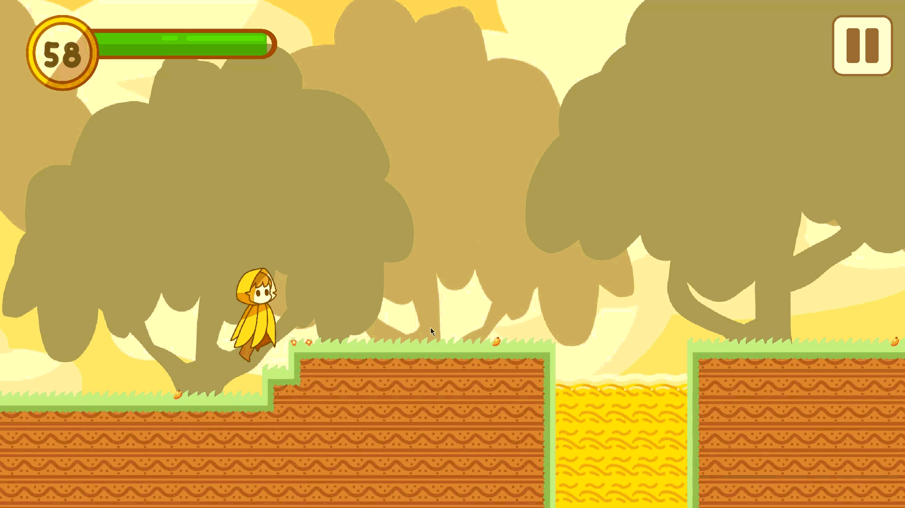
</p>

---

## ✨ Features

* ⏱️ **Rot Timer** — your remaining time is also your survival resource.
* 🍌 **Visual Decay** — the player's body visually rots as time runs low.
* ⏳ **Time Restoration** — defeating enemies restores part of your remaining time.
* ⚔️ **Action Combat** — fight enemies using melee and ranged attacks.
* 💨 **Platforming Movement** — run, jump, and dash through each level.
* 🏹 **Ranged Attack** — unlock a ranged attack starting from the Peach level.
* ⚡ **Triple B's Laser** — aim at enemies and use the laser to temporarily stun them.
* 👹 **Four Boss Encounters** — each boss introduces different attacks and mechanics.
* 🧩 **Artifact Pieces** — defeat each boss and recover a piece of the stolen artifact.
* 💔 **A Corrupted Ally** — a friend introduced during the journey eventually becomes part of the final threat.

---

## 🎮 Controls

| Action            | Input         |
| ----------------- | ------------- |
| Move              | `A / D`       |
| Jump              | `Space`       |
| Dash              | `Shift`       |
| Melee Attack      | `Left Click`  |
| Shoot             | `Right Click` |
| Triple B Laser    | `E`           |
| Continue Dialogue | `C`           |

### ⚡ Triple B Laser

Aim the mouse cursor **directly at the enemy** you want Triple B to target, then press `E`.

> The laser requires the cursor to be positioned on the enemy. Simply placing the cursor near the enemy will not activate the attack.

---

# 🧠 Core Concept

## ⏱️ The Rot Timer

The **Rot Timer** is the heart of Overripe.

Time is not simply a countdown — it is part of the player's survival.

As the timer decreases, the Banana gradually begins to rot.

Defeating enemies can restore part of the remaining time, creating a constant choice between **moving forward quickly** and **fighting to recover valuable time**.

```text
More Time
    ↓
Healthy Banana
    ↓
Visual Decay
    ↓
Critical Time
    ↓
Rot
    ↓
Game Over
```

### Core Loop

```text
Explore
   ↓
Fight Enemies
   ↓
Gain Time
   ↓
Reach the Boss
   ↓
Defeat the Boss
   ↓
Collect Artifact Piece
   ↓
Progress
```

---

## 🎯 Design Pillars

### ⏱️ Race Against Rot

Time pressure is directly connected to the player's physical decay, making the countdown part of the character rather than just a UI element.

### 👹 Escalating Boss Encounters

Each level introduces a new boss encounter with different attacks, mechanics, and challenges.

### 💔 A Friend Becomes the Final Threat

An ally introduced during the journey eventually becomes part of the final battle, bringing the story back to a character introduced earlier in the game.

---

# ⚔️ Combat

Combat is built around managing **risk, positioning, and time**.

### 🗡️ Melee Attack

The player's primary close-range attack can be used against regular enemies and bosses.

### 🏹 Ranged Attack

The ranged attack becomes available starting from the **Peach level**, allowing the player to attack enemies from a safer distance.

### ⚡ Triple B Laser

Triple B's Laser provides additional ranged support and can temporarily **stun enemies and bosses**, creating opportunities to attack or reposition.

---

## 🎥 Gameplay Showcase

<p align="center">
  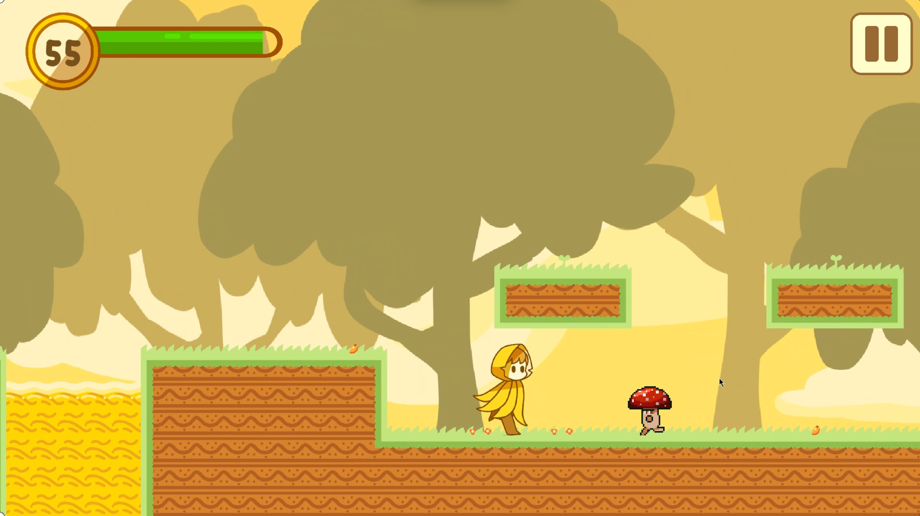
  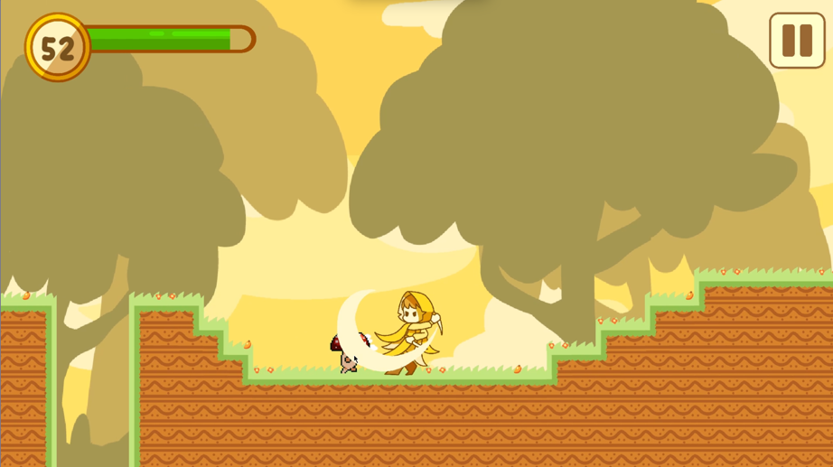
  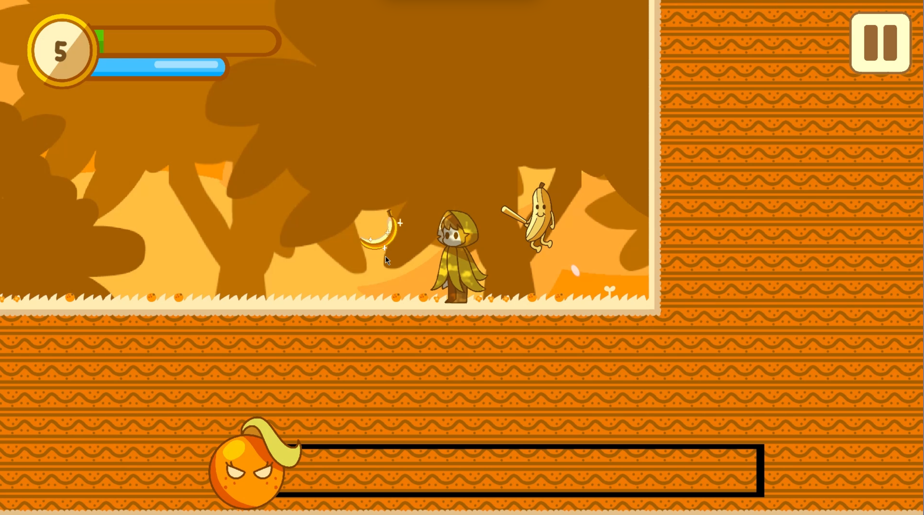
</p>

<p align="center">
  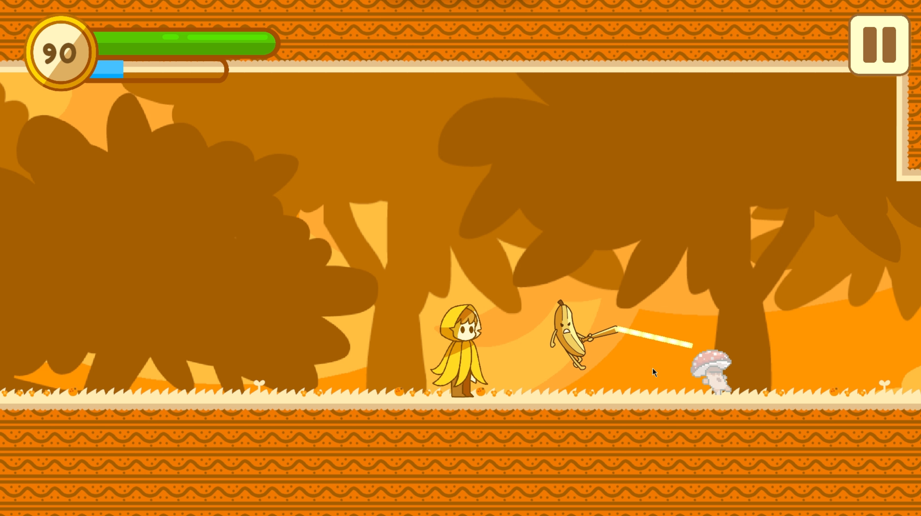
  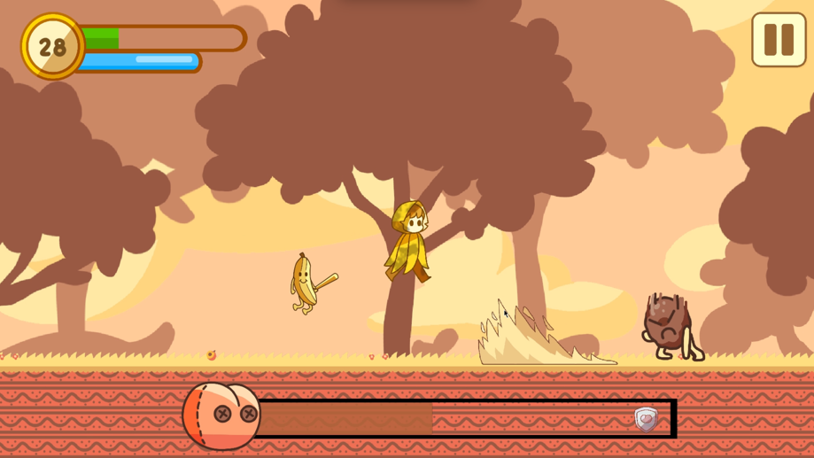
  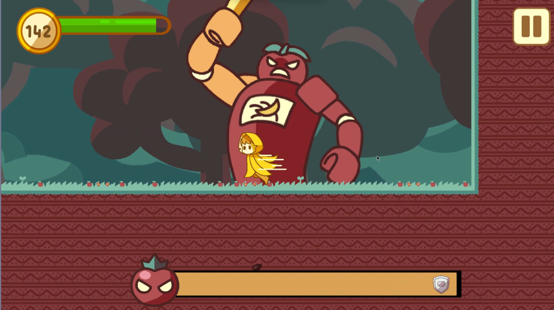
</p>

---

# 🗺️ Levels

| Level | Theme     | Boss                  | Highlights                                                              |
| ----- | --------- | --------------------- | ----------------------------------------------------------------------- |
| 1     | 🥭 Mango  | Mango Boss            | Jump-slam and juice-squeeze attacks                                     |
| 2     | 🍊 Orange | Orange Boss           | Meet Triple B, unlock the Laser, charging attacks and summoned soldiers |
| 3     | 🍑 Peach  | Peach Boss            | Rolling, dust and wave attacks; shielded second phase                   |
| 4     | 🍎 Apple  | Apple Boss + Triple B | Final battle against the fused threat                                   |

---

# 👹 Bosses

<p align="center">
  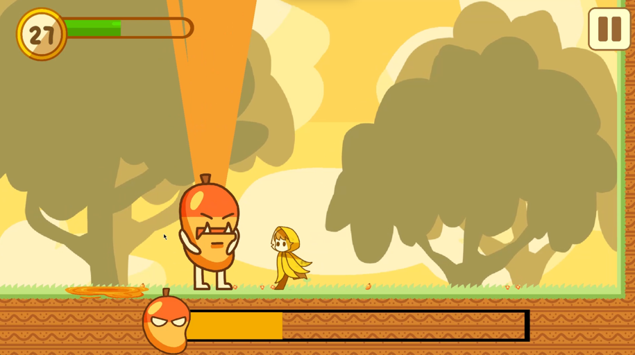
  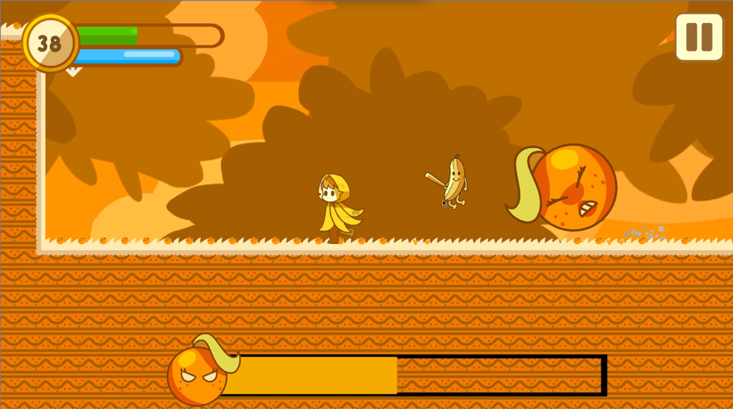
  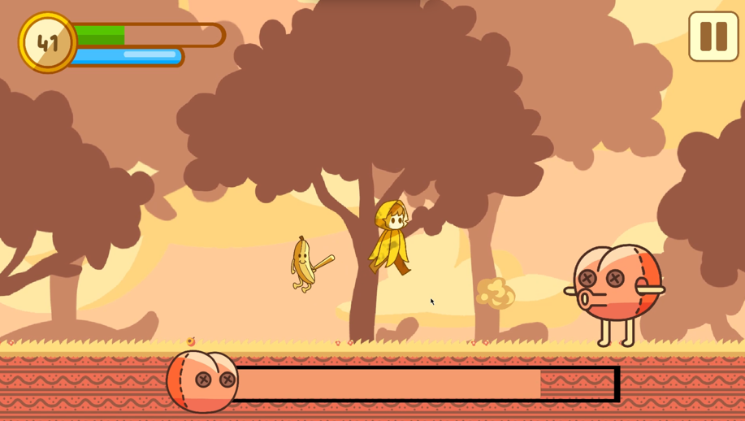
  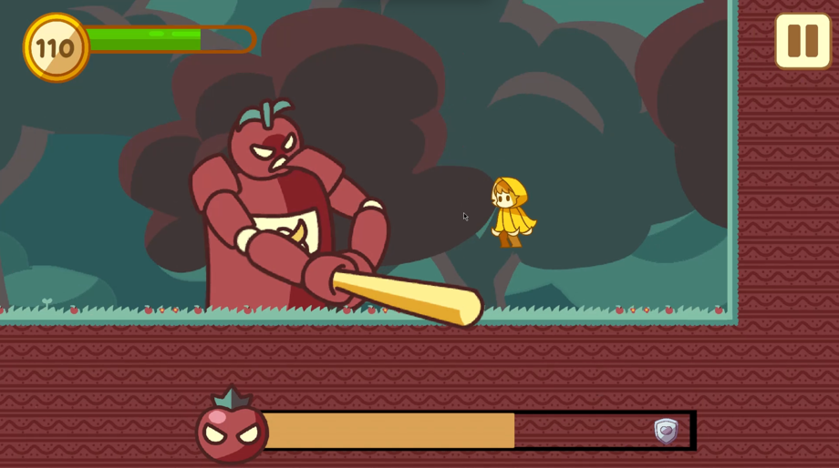
</p>

### 🥭 Mango Boss

The first boss introduces the player to stronger attacks and environmental pressure, including powerful jump-slam and juice-squeeze attacks.

### 🍊 Orange Boss

The Orange Boss introduces charging attacks and summoned soldiers.

This is also where the player meets **Triple B** and gains access to the Laser ability.

### 🍑 Peach Boss

The Peach Boss introduces a more defensive encounter featuring rolling attacks, dust attacks, waves, and a shielded second phase.

The player also gains access to the ranged attack during this stage.

### 🍎 Apple Boss

The final encounter brings the story full circle.

The player faces the **Apple Boss alongside the corrupted Triple B**, turning a former ally into part of the final threat.

---

# 🍌 The Rot Timer in Action

<p align="center">
  
</p>

The player's remaining time is directly connected to their condition.

As time runs out, the Banana becomes increasingly rotten until the timer reaches zero.

This turns the timer into an active gameplay mechanic rather than a passive countdown.

---

# 💥 Final Encounter

The final level brings together the game's main mechanics and story elements.

The player faces the **Apple Boss**, while **Triple B**, once an ally, becomes part of the final threat.

The encounter combines combat, positioning, timing, and the pressure of the Rot Timer.

<p align="center">
  
</p>

---

# 🛠️ Built With

* **Unity 6000.3.22f1**
* **C#**
* **Unity Input System**
* **Cinemachine**
* **2D Physics**
* **Unity Animation System**

---

# 🚀 Running From Source

## Requirements

* Unity Hub
* **Unity 6000.3.22f1**

## Installation

Clone the repository:

```bash
git clone <repository-url>
```

If the repository uses Git LFS for large files:

```bash
git lfs install
```

Then:

1. Open **Unity Hub**.
2. Add the cloned project.
3. Open the project using **Unity 6000.3.22f1**.
4. Allow Unity to import and compile the project.
5. Open the `Main Menu` scene.
6. Press **Play**.

---

# 👥 Team

**Overripe** was developed by a team of **2 programmers and 1 artist**.

| Name              | Role       |
| ----------------- | ---------- |
| Maryam Ahmed      | Programmer |
| Salma Mahmoud     | Programmer |
| Zinab Mahmoud     | Artist     |

---

# 📅 Development Timeline

| Dates            | Phase                        |
| ---------------- | ---------------------------- |
| **Aug 26–28**    | Game concept and GDD         |
| **Aug 29–Sep 4** | Prototype V1                 |
| **Sep 5–11**     | Prototype V2                 |
| **Sep 12–17**    | Final development and polish |
| **Sep 18–20**    | Final testing and submission |

---

# 🎵 Credits

| Asset         | Source       
| ------------- | ------------ 
| Mushroom      | itch.io     
| Bat           | itch.io     
| Sound Effects | google 

All original gameplay code, game design, and original art were created by the team.

Third-party assets remain subject to their respective creators' licenses and terms.

---

# 🏆 Competition

## IEEE Victories 5.0 Game Development Competition

**Organizer:** IEEE Mansoura Student Branch
**Theme:** Time

**Overripe** was developed specifically for the competition as a 2D action platformer built around the idea of **time becoming a physical threat to the player**.

---

# 📄 License

This project was created as a game jam / competition project.

If you intend to make the source code publicly reusable, add an appropriate open-source license here.

---

<p align="center">
  🍌 <strong>Overripe</strong> — Every second brings you closer to rot.
</p>
